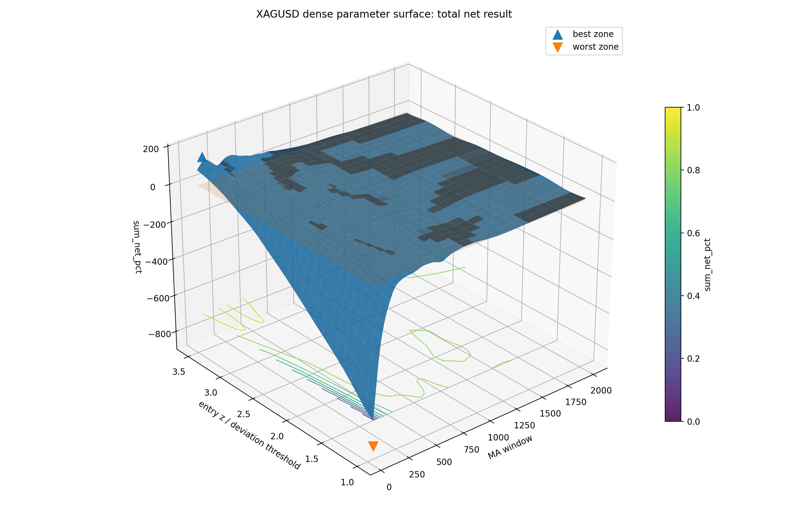

# Adaptive Parameter Optimisation Algorithm

## Idea

This project is an iteration of the first project and this time a more general adaptive mean reversion system. The idea is still relatively simple, but I wanted to make it less fixed than my first project. Instead of only testing one asset and one manually chosen setup, this version first researches the market and then uses that research to choose parameter ranges that make more sense for that specific instrument.
The goal is to test whether the same general system can adapt across different market types such as commodities, equity indices, FX/currencies and Risk on Assests.

## Why I built this

The main issue with my first project was that the algorithm was not very adaptive and did not generalize well across different markets or market regimes. It worked on the specific asset and timeframe I had downloaded, but the results were fragile. Once fees, slippage, changing market conditions and different regimes are included, the strategy becomes much less useful as a general approach.

I also had to manually research and choose the parameter ranges myself based on a relatively small dataset. That made the project more vulnerable to overfitting, because the parameters were chosen around the data I had instead of being part of a more general workflow.

## How the system works

The new approach is to merge the research step and the backtest step into one workflow. For each instrument, the algorithm first looks at the data and tests different combinations of moving average ranges, deviations from the moving average, volatility adjusted thresholds and the number of valid entry signals.

The idea is not to test every possible setting forever, but to narrow the search space to the areas where there are enough signals and where the average exit is large enough to still make sense after fees and slippage.

For example, the algorithm may start with a broad moving average range like MA50 to MA2000. After looking at the data, it might narrow the useful area down to something like MA300 to MA500, if that is where the signal appears often enough and where enough trades also have a realistic exit point. So instead of forcing the same setup on every market, each market gets its own researched parameter area.

Every buy signal then gets assigned a confidence score. The confidence is based on where the signal lies compared to similar signals in the past. If similar signals historically had a higher probability of reaching take profit, then the current signal gets a higher confidence score. If the signal bucket was weaker or less reliable, the confidence is lower.

The confidence score then affects the trade itself. Higher confidence can mean a bigger position size and more room for the trade to develop, while lower confidence should mean a smaller position and a tighter exit. The idea is that not every signal should be treated the same, because some signals are historically much stronger than others.

## Stops and exits

The system also uses a time based stop. If a trade stays open for too long, it probably no longer behaves like the original mean reversion setup. So instead of letting trades stay open forever, the algorithm cuts them after a certain holding time.

This cutoff can be based on the historical holding time distribution. A simple version is to cut trades above the third quartile, also called Q3. A stricter version would use an IQR based cutoff like Q3 plus 1.5 times the IQR, which is a common way to detect values that are unusually far away from the normal range.

The point of that is to remove trades that take unusually long and are more likely to become low quality positions.

## What I noticed after the first backtest

After the first backtest the results looked promising, but when I looked at some of the upside and downside outliers, I noticed that the entry and exit logic was still too rigid. A lot of trades were closing slightly negative, while some stronger moves had their upside capped too early.

So the issue was not only finding entries, but also managing the trade after entry. The next idea is to make both entries and exits more adaptive. If the confidence of the signal is higher, the system should allow more flexibility. That could mean a larger position size, a wider possible entry area if price deviates further from the moving average, and also a more flexible exit.

For the exit, the idea is to sell most of the position at the first take profit level, but keep a smaller part open if the confidence is high enough. That remaining part could then aim for higher take profit levels in a grid like way, while still being liquidated if price falls a certain percentage below the target area.

These examples show one strong trade and one weak trade from the actual saved backtest. I included both because I wanted to see what the system really did around entry and exit, not only the final summary statistics.

The main goal was to build a workflow that can research a market, choose more reasonable parameter ranges, assign confidence to signals and then show clearly where the system works and where it fails.

## Visuals

To make the parameter search easier to understand, I generated a dense parameter surface for the strongest candidate. The graph shows how different moving average windows and entry thresholds performed against each other, instead of only showing one final parameter choice.

The 2D view is useful because it shows whether the result comes from a wider stable region or just one isolated peak.

The interactive version can be opened here:

https://romanmski.github.io/Adaptive_Parameter_Optimisation_Algorithm/visuals/xagusd_parameter_surface.html

## Cross-market diagnostics

I also compared the results across symbols, because I did not want the project to depend only on one good-looking market.

## Risk diagnostics

I also looked at the downside, not only the best-looking result.

The risk chart compares the tested symbols by performance and drawdown behaviour. I included this because a parameter surface can look interesting, but the strategy is not useful if the downside is too unstable or if the result depends on one extreme move.

