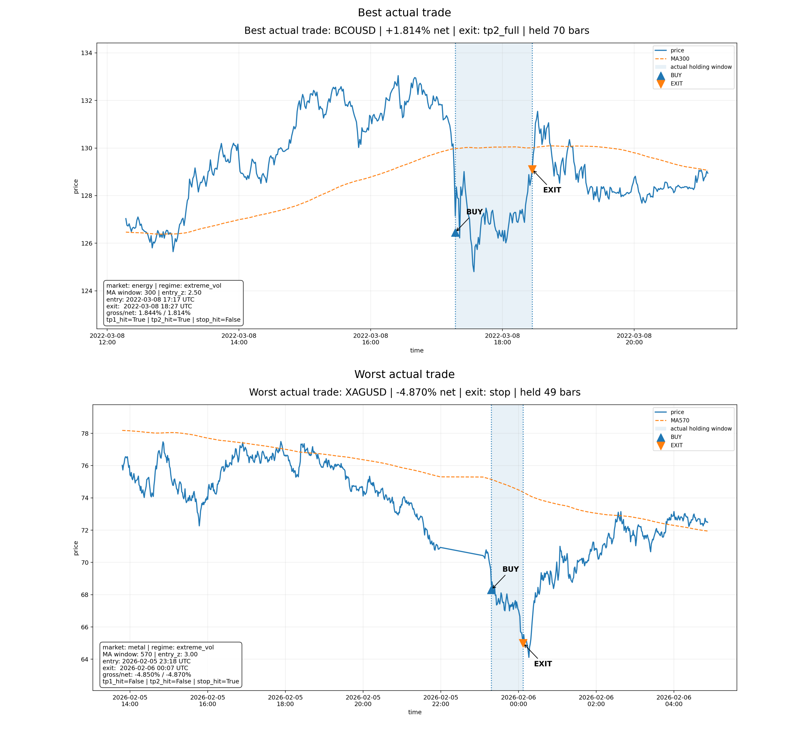
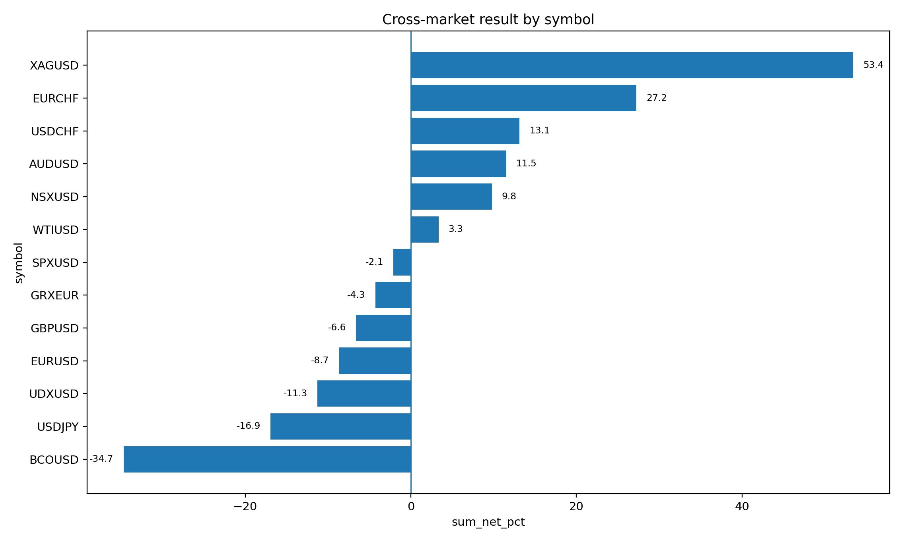
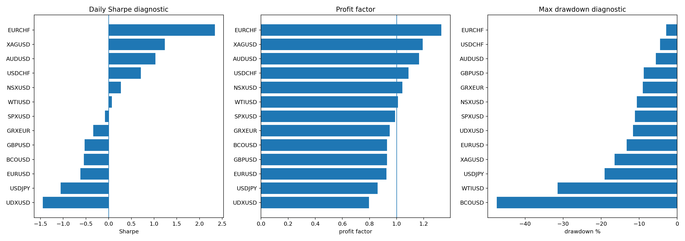

# Adaptive Parameter Optimisation Algorithm

This repository is a redacted public view of a private quantitative research project I have been building for months. The private system is about adaptive parameter search, execution aware backtesting and capital allocation across competing signals. This public version is not meant to be a cloneable trading strategy. It is meant to show the research architecture and the level of validation behind the work, while keeping the actual edge private.

The starting point was a simple problem I kept running into: a fixed setup can look good in one market, one volatility regime or one hand picked window, and then become useless as soon as costs, execution or market structure changes. I did not want to keep manually choosing one moving average, one deviation and one exit rule and then overinterpreting the best result. The more interesting question was whether the system could research the market first, map the parameter space, find stable regions, and then reject candidates that only worked because the search process gave them too many chances to get lucky.

The private implementation has more moving parts than this repository shows. Exact markets, candidate identities, search domains, final parameters, sleeve weights, execution logic and live deployment details are intentionally not public. Those are the parts that would make the research too easy to copy. The public layer focuses on the part I actually want to show: how I think about parameter surfaces, overfitting, execution assumptions, skipped opportunities, capital competition and robustness.

The core idea is parameter island thinking. I do not trust a single best point very much. If a candidate only works at one exact coordinate and collapses around it, that usually says more about the search process than about the market. A wider area of similar results is more interesting because it suggests that the candidate is not just a tiny accident in a high dimensional grid. This is why the project looks at the shape around a candidate, not only the headline return.

This also changed how I treated the backtest itself. The backtest is not the end of the research. It is one object that has to be attacked from multiple angles. I care about neighbouring parameters, different time windows, worse costs, worse fills, drawdown shape, concentration, and whether the logic could be regenerated from new bars without looking into the future. A clean equity curve is not enough if it cannot survive those questions.

The harder part became allocation. Once multiple signals or sleeves exist, the system is no longer only asking whether one signal is good. It has to decide whether that signal is the best use of capital at that moment. A position can be profitable and still block a better opportunity. A new signal can look strong but be less useful than a trade already open. This pushed the project away from isolated strategy testing and toward portfolio replay with skipped opportunities, capital constraints and execution realism included in the research loop.

The public examples below are simplified or older diagnostics. They are included to make the research process visible, not to reveal the current private candidate. The dense surface shows why I care about the geometry of the search space. A surface that contains broad stable regions tells a different story than one sharp peak surrounded by failure.

  

There is also an interactive version of the parameter surface here:

[Open the interactive parameter surface](https://romanmski.github.io/Adaptive_Parameter_Optimisation_Algorithm/visuals/xagusd_parameter_surface.html)

One of the biggest lessons was that exits and holding time are not secondary details. Some trades were not bad because the original signal was useless. They were bad because the exit logic did not fit the path that followed. Other trades looked good only because the assumed fill was too generous. That is why the diagnostics include actual trade paths, holding windows, take profit behaviour and failure cases instead of only summarising final return.

  

I also wanted the research to show where the idea fails. A model that only presents the best market is not very useful. Cross market tests are useful because negative evidence defines the boundary of the system. If the same workflow works in one environment and fails in another, that is information. It tells me whether I am looking at a general process, a market specific effect, or just a lucky pocket.

  

The risk diagnostics are there for the same reason. I do not want to judge a candidate by one return number. I want to know how much drawdown it needed, how fragile the profit factor was, how sensitive it was to costs, and whether the result depended too much on one market condition. If I cannot explain why a candidate survived, I do not want to trust it.

  

This project became less about finding one impressive backtest and more about building a research process that is harder to fool. The useful work was in turning a messy idea into testable components, building diagnostics around each failure mode, and forcing the system to keep track of what was searched, what was rejected, and what still needs stronger evidence.

The public repository should therefore be read as a research showcase, not a trading product. It demonstrates adaptive parameter search, parameter surface analysis, robustness thinking, execution aware backtesting, trade path diagnostics and capital allocation reasoning. It does not publish the current private strategy, live system, final parameters, selected candidates or execution rules.

This is not financial advice and it is not proof of future profitability. It is a redacted view into an ongoing private quant research project.

The public stack is mainly Python, pandas, NumPy, matplotlib, Plotly, parameter surface analysis, backtest diagnostics, stress testing and research visualization.
