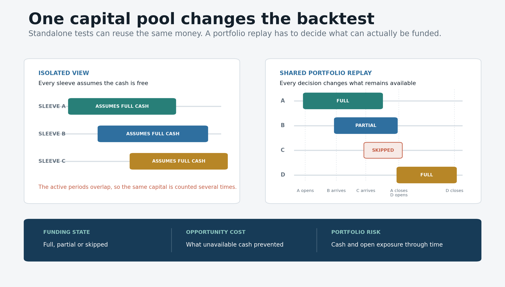
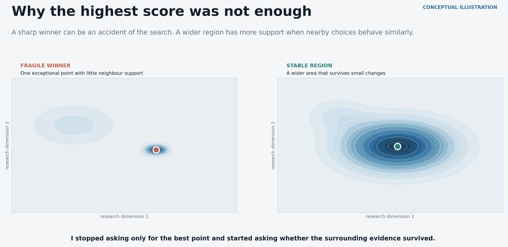

# Adaptive Portfolio Research System

This repository is a selected public view of a quantitative research project I have been building for several months. The full workspace is roughly 500 GB and one of the largest search and validation runs used a high specification cloud VM continuously for about five days. This is not a page built around one attractive backtest. It shows how the original idea developed into a research system that has to compare many possible setups, allocate one limited pool of capital and reject its own results when the evidence is not good enough.

The question at the centre of the project became surprisingly simple: when several valid opportunities appear at the same time, which one actually deserves the capital now?

## The idea

Instead of forcing one fixed rule onto every market, I treat each self contained candidate as a sleeve. The sleeve abstraction can represent a different market, timeframe, factor combination, set of decision rules or risk logic. The wider research design is deliberately not tied to one disclosed indicator. What matters is that every sleeve has a frozen identity, can be replayed using only information available at the time and can be compared with other sleeves under the same assumptions.

When a setup appears, the system looks at how comparable completed setups behaved before that moment. The amount of relevant history, the distribution of outcomes, the current context and the quality of the execution assumptions all affect how much confidence the setup deserves. Confidence is evidence, not certainty. A high confidence sleeve can still be rejected when its sample is too thin, its performance is unstable across time, its result depends on one market or its fills are too optimistic.

Several sleeves can qualify at once, but they cannot all pretend to own the same money. They have to compete for one shared pool of capital. The portfolio replay records whether each opportunity was funded fully, funded partly or skipped, then keeps track of the cash and open exposure through time. This made opportunity cost visible and changed the research question from finding more signals to deciding which signals are worth funding.

## Where it became difficult

The number of possible combinations grew very quickly once markets, timeframes, factors, filters, exits and portfolio rules could vary together. Working with second and minute data meant that a naive search was both slow and difficult to audit. I moved repeated transformations into reusable Parquet caches, gave candidates deterministic identities, stored the configuration of every serious run in a manifest and split long jobs into restartable stages. A large run is only useful when every result can be traced back to the data, code and assumptions that produced it.

The search itself created another problem. If enough combinations are tested, one point will usually look exceptional by chance. I therefore stopped treating the highest score as the answer and started inspecting the area around it. A useful candidate should have support from nearby choices, separate periods and different cost assumptions. A broad stable region is more interesting than a sharp isolated optimum, even when the isolated point has the better headline result.

Execution and portfolio accounting were just as important as the search. A candle touching a limit price does not prove that an order would have filled. An equity curve that updates only when trades close can hide losses that existed while positions were open. I added stricter fill assumptions, fee and slippage stress, minute level mark to market reconstruction, a low price risk envelope and reconciliation between the cash ledger and final equity. These checks made the results less flattering and much more useful.

## The audit that changed the project

The most important issue I found was only one timestamp. An hourly feature was labelled at the start of the hour even though it used the completed close of that hour. That allowed future information into an earlier decision. I first recovered the original behaviour exactly from raw data, which proved that the old code path could be reproduced. I then separated reproduction from causality, moved the feature to the first moment at which its inputs really existed and regenerated the decisions.

After the correction, I froze the candidate before opening a later evaluation window. It failed the predefined future test and became weaker under harsher cost assumptions, so I rejected it for deployment. That failure is more valuable than using the original historical return as a headline. It showed that exact reproduction can coexist with a causal defect and that a promising backtest has to be allowed to fail.

## What I built and learned

The implemented research tooling covers raw data reconstruction, timestamp and gap checks, reusable timeframe caches, deterministic candidate identities, run manifests, restartable search stages, confidence filtered sleeve generation, shared cash allocation with full, partial and skipped funding, minute level portfolio reconstruction, cost and fill stress, concentration analysis, leave one market out tests and untouched future evaluation gates. The work was done mainly in Python with NumPy, pandas, Numba, Parquet, vectorised transformations and cloud compute.

The harder part was learning what not to trust. A large search can create more convincing false winners. A reproducible result can still use information too early. A collection of profitable standalone tests can still describe a portfolio that could never have been funded. A high confidence label can still hide a small or unstable sample. Each of those failures became a permanent check instead of a footnote added after the result.

I kept a running research log while the idea changed. It helped me compare the system I intended to build with the behaviour that was actually implemented, especially when an output looked too good or a coding shortcut quietly changed the research question. The most useful discipline was keeping four things separate: the idea being tested, the behaviour present in the code, the result observed in one run and the evidence required before deployment.

Some branches of the wider project are still ideas rather than completed features, so I do not present them here as finished work. Lower level order book replay, stronger controls for repeated testing and a longer future only paper trading record still require more evidence. The goal of this public extract is to show the research process and the engineering behind it without publishing the complete private workspace or the exact signal definitions.

The diagrams in this repository can be regenerated with `python tools/build_readme_visuals.py` after installing the two packages listed in `requirements.txt`. I kept the public package intentionally small so that every visible artifact supports the research story above. The complete datasets, private implementation and exact signal definitions are not part of this repository.

This is ongoing research, not a trading recommendation.
