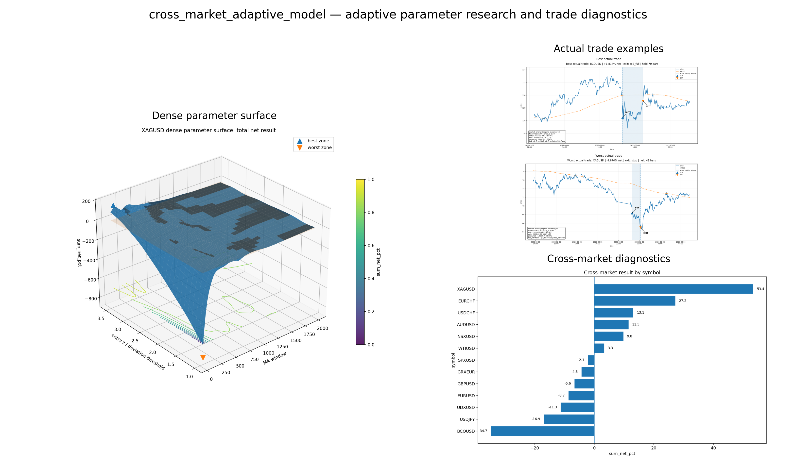

# Adaptive Parameter Optimisation Algorithm

This project is the next step after my first XAUUSD mean reversion research.

The first version answered one narrow question: can a fixed moving average deviation setup show useful short horizon rebound behaviour after costs and stricter exits?

This version asks a harder question. Can the system research a market first, find stable parameter regions, adapt the trade logic to the instrument, and still stay honest about costs, drawdown and overfitting?

I am not publishing the exact private strategy, selected parameters, full search domains or execution rules. The public version is meant to show the research process, the diagnostics and the kind of thinking behind the system without giving away the edge.

## The Core Idea

Most simple mean reversion tests are too fixed.

Pick one moving average. Pick one deviation. Pick one take profit. Backtest it. If it looks good, it is very tempting to call it a strategy.

That is exactly the trap I wanted to avoid.

In this project the moving average, timeframe, entry deviation, position structure, exit logic and confidence threshold are treated as things the system has to research. The market is not forced into one manually chosen setup. The algorithm searches for areas where the signal appears often enough, where the exit distance is still realistic after costs, and where nearby parameter choices do not immediately collapse.

The useful object is not one perfect parameter point. It is a parameter island.

A parameter island is a region where many nearby setups behave similarly. One isolated peak can be luck. A broader island is more interesting because it suggests that the result is not only a tiny accident in the search space.

  

## How I Think About The System

The base signal still starts with price as a deviation from a moving average.

But the system around that signal is the important part.

For each market, the research layer scans a broad space first. It looks at moving average windows, deviation levels, volatility conditions, signal frequency and historical exit behaviour. Then it narrows the search into regions that look more useful.

After that, the system can attach adapters to the strategy. These are not meant as decoration. They are there because a fixed rule can behave very differently when volatility changes, liquidity changes or the market moves into a different regime.

The private research version explores adapters such as:

- volatility estimation, including GARCH style regime information
- gradient descent style refinement around promising parameter regions
- Monte Carlo style stress checks for robustness and path sensitivity
- confidence scoring from similar historical setups
- portfolio allocation when several sleeves compete for the same capital
- cost, slippage and fill realism checks

The exact implementation details are not public, because that is where the real edge would live. The public point is the research structure.

## Confidence Instead Of Blind Entries

Not every entry signal should be treated the same.

If a setup looks similar to past situations where price often reached the researched take profit, it should receive more confidence. If the sample is weak, noisy or historically poor after costs, it should receive less confidence or be ignored.

That confidence can affect the trade in several ways. It can change whether the signal is taken, how much capital is allocated, how much room the trade receives, and whether a partial exit is more sensible than waiting for the full target.

This is also why the system cannot only optimise raw return. A high return setup is not automatically better if it comes from one rare event, one unstable parameter point or one fragile market regime.

## Entries, Exits And Time

The first version taught me that the exit logic matters as much as the entry.

Some trades failed because they were held too long. Some trades were cut too early. Some losing trades were actually decent signals, but the time stop was too rigid. That does not mean the stop was wrong. It means the stop itself should be researched instead of guessed.

So the system studies holding time distributions, successful trade lengths, failed trade lengths and the behaviour around take profit zones. A simple version can use a Q3 or IQR based time cutoff. A more adaptive version can make the cutoff depend on the setup quality, volatility and current trade behaviour.

The same idea applies to exits. A trade can sell at the first target, keep a smaller part open, sell on retrace, or exit when the probability of reaching a better target becomes too weak. These choices have to be tested against a baseline, not added emotionally because one chart looked annoying.

  

## Cross Market Testing

I did not want this to be a project that only looks good on one chart.

The system was tested across different kinds of markets, including commodities, FX, equity indices and risk on assets. The point was not to pretend that one universal setting works everywhere. The point was to see where the adaptive workflow finds useful regions and where it fails.

That distinction matters. A negative result on some markets is not embarrassing. It is useful because it shows that the system is not simply being forced to say yes.

  

## Risk Diagnostics

I care much more about how a result survives stress than how good one final number looks.

The diagnostics look at drawdown, profit factor, Sharpe behaviour, cost sensitivity and whether performance depends too much on one symbol or one market condition. A surface can look beautiful, but if the downside is unstable or the result disappears after slightly worse costs, I do not trust it.

  

## What The Visuals Show

The dense parameter surface is useful because it makes the search space visible. Instead of only showing the final choice, it shows whether a candidate sits inside a stable region or on a sharp isolated peak.

  

There is also an interactive version of the parameter surface here:

[Open the interactive XAGUSD parameter surface](https://romanmski.github.io/Adaptive_Parameter_Optimisation_Algorithm/visuals/xagusd_parameter_surface.html)

## What This Project Shows

This repository shows that I can take an idea, turn it into a research process, build diagnostics around it and be honest about what can go wrong.

The important parts are:

- market specific parameter research
- parameter island thinking instead of single point optimisation
- adaptive entries and exits
- confidence based signal quality
- volatility and regime aware adapter design
- Monte Carlo and cost stress thinking
- cross market diagnostics
- risk checks instead of only headline return

## What This Project Does Not Show

This is not a trading bot someone can clone and run.

It does not publish the exact private strategy, live deployment setup, final sleeve weights, selected execution rules or full search space. It also should not be read as financial advice or proof of future profitability.

The goal is to show the research quality without giving away the parts that would make the strategy easy to copy.

## Relation To The First Project

The first project was the XAUUSD intraday mean reversion study. It showed that some mean reversion behaviour exists, but that the edge is fragile under transaction costs and stricter exits.

This project is my answer to that problem. Instead of manually picking one setup, the system researches the market, searches for stable regions, checks risk and then builds more adaptive rules around the signal.

The first project asked whether the signal exists.

This project asks whether the process can find and manage better versions of that signal.

## Tools

Python, pandas, NumPy, matplotlib, Plotly, statistical testing, parameter surface analysis, volatility modelling, gradient descent style refinement, Monte Carlo stress testing and backtest diagnostics.
