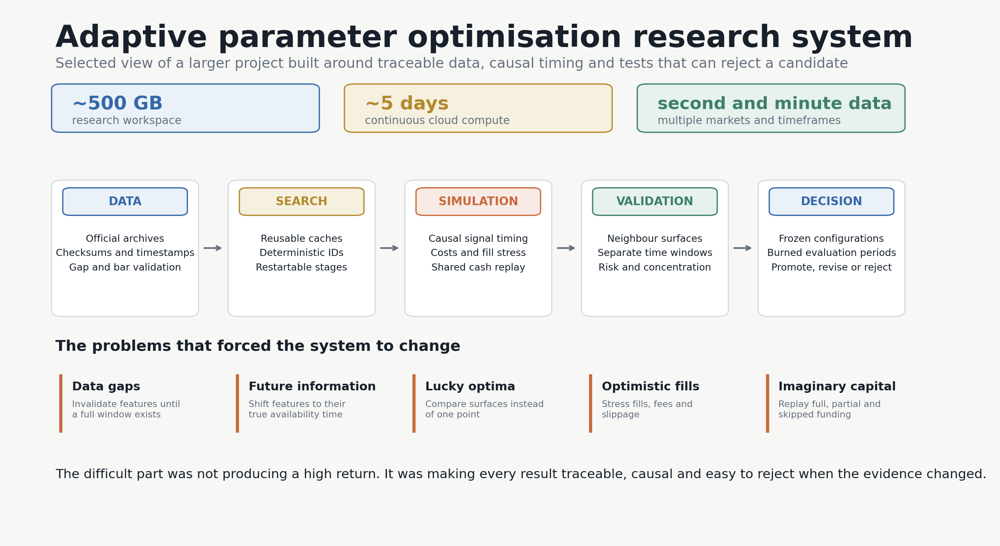
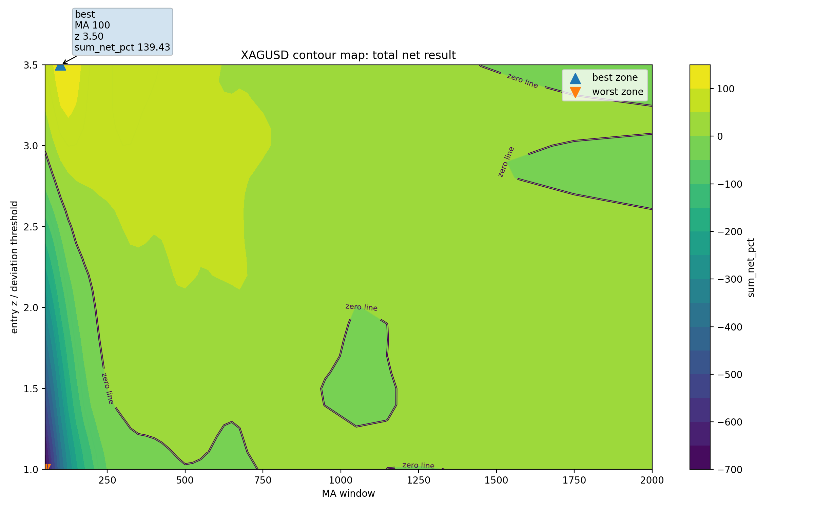
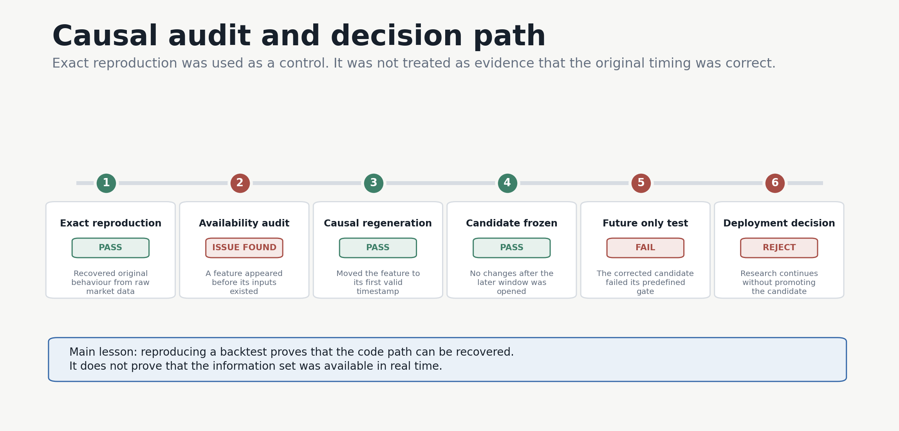
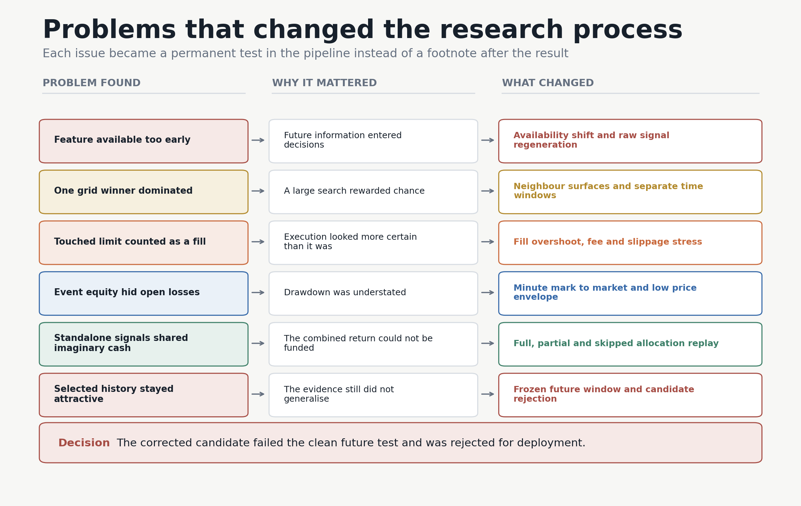

# Adaptive Parameter Optimisation

This repository is a selected extract from a larger private quantitative research project I have been working on for several months. The complete workspace now contains roughly 500 GB of raw market data, processed datasets and generated research artifacts. One of the larger search and validation cycles ran for about five days on a high specification cloud VM. I cannot publish the whole workspace, but this extract shows the part that matters most: how the research question developed, what failed, how I found the problems, and what I changed because of them.

The project started with a simple frustration. Picking one moving average, one entry threshold and one exit rule by hand can produce a convincing backtest, but the result says very little about whether the parameters describe something stable or just one lucky point. I wanted to map the surrounding parameter space, preserve wider regions that remained useful, and test those regions under different periods, costs and execution assumptions. As the search grew, the project stopped being only an optimisation problem. It became a data engineering, causal timing, portfolio accounting and model validation problem as well.

## From an idea to a research system

Working with second and minute data across multiple markets, timeframes and candidate families made a naive exhaustive search too expensive and too difficult to audit. The larger runs produced enough intermediate data that I had to treat the research pipeline as a system. Raw archives are checksum verified, timestamps are normalised, price bar invariants and gaps are checked, processed data is stored in Parquet, and reusable timeframe caches keep repeated work manageable. Candidates receive deterministic identities and every serious run writes its configuration and output metadata to a manifest. Long jobs are separated into restartable stages so that a failure near the end does not erase days of compute.

This was one of the main lessons from the project. Compute scale is only useful when every result can be traced back to the exact data, configuration and assumptions that created it. A five day run that cannot be reproduced is less valuable than a smaller run that can be audited properly.

Parameter search created a second problem. The best point in a large grid is often the point that benefited most from chance. I therefore stopped treating the optimum as the research object and started looking at the local surface around it. Neighbour support, separate time windows, monthly return distributions, drawdown, concentration and cost sensitivity all became part of the candidate decision. A broad region that behaves similarly is more interesting than a sharp isolated maximum, although it is still only a candidate and not proof.

  

The same surface can be explored in an [interactive three dimensional view](https://romanmski.github.io/Adaptive_Parameter_Optimisation_Algorithm/visuals/xagusd_parameter_surface.html).

## What went wrong

The most important error I found was not a crash or a wrong formula. A regime feature was timestamped at the start of an hourly bar even though it used the completed close of that hour. This allowed information from the future to enter the decision process. The original system could be reproduced exactly, which was useful as a control, but exact reproduction did not make it causal. I separated those two questions, shifted the feature to the first time it was actually available, regenerated the signals from raw data, and froze the corrected candidate before looking at later data.

The corrected version still looked strong on selected history, but it failed a clean future window and became weaker under harsher cost assumptions. I rejected it for deployment. I have not made the historical return the headline of this repository because the more useful result was the failure itself. The audit showed that a large backtest can survive code reproduction while still failing causality and forward validation.

Execution assumptions caused another change. A candle high touching a limit price does not prove that the order would have filled. An equity curve updated only at trade events can also hide losses that existed while a position was open. I added fee and slippage stress, stricter limit fill requirements, minute level mark to market reconstruction, a low price risk envelope, and reconciliation between the cash ledger and final equity. These checks made the execution model less flattering and more useful.

Shared capital created a separate accounting problem. When several signals arrive together, not all of them can receive the capital assumed by their standalone backtests. Some are fully funded, some only partly, and others have to be skipped. Replaying every accepted signal through one cash constrained portfolio showed why adding isolated strategy returns together was wrong and made the opportunity cost of an open position visible.

## What changed

The system now treats data availability and evaluation history as part of the research state. A gap invalidates new signals until a complete feature window has been rebuilt. Once an evaluation period has been inspected, it cannot later be described as a fresh holdout. A change to the logic creates a new candidate identity instead of quietly replacing the old one. Results are broken down by time, market and contribution so that one exceptional period cannot hide a weak base.

The optimiser can rank candidates and decide where to spend compute, but it does not make the final decision. The final decision uses several views of the same candidate: neighbouring parameters, performance across time, mark to market drawdown, cost and fill stress, concentration, activity, and the future test. Before a serious run, I now try to define what evidence would disqualify the candidate. That makes rejection part of the method rather than something explained away after the result is known.

## What I learned

The most useful technical work was spread across Python, NumPy, pandas, Numba, Parquet, vectorised transformations, causal resampling, deterministic configuration hashing, run manifests, cloud compute, backtest engineering, portfolio cash accounting, mark to market risk, stress testing and research visualisation. The harder lesson was that complexity is not the same as quality. A more complicated model can create more ways to be wrong, and a larger search can create more convincing false winners.

I also learned to separate four things that are easy to mix together: the idea I want to test, the behaviour that is actually implemented, the result observed in a particular run, and the evidence required before deployment. Keeping those layers separate made it possible to reproduce an old result, find a causal defect in it, correct the defect, and then accept that the corrected candidate failed its future test.

The remaining work is clear. Lower level order book replay, stronger controls for repeated testing, and longer paper trading windows using only future data still need more evidence. This repository does not claim that the research problem is solved. It shows how the project became more rigorous after the first attractive answers turned out to be incomplete.

The repository contains selected parameter surfaces, validation diagrams, older trade diagnostics and an interactive visual. The overview figures can be regenerated with the small Matplotlib builder in `tools`. The full datasets and research system are not included because of their size and because the work is still ongoing.

This is an ongoing research project, not a trading recommendation.
